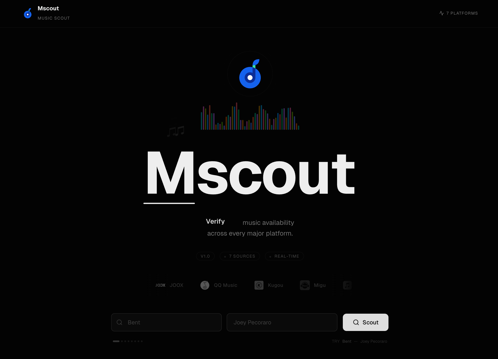
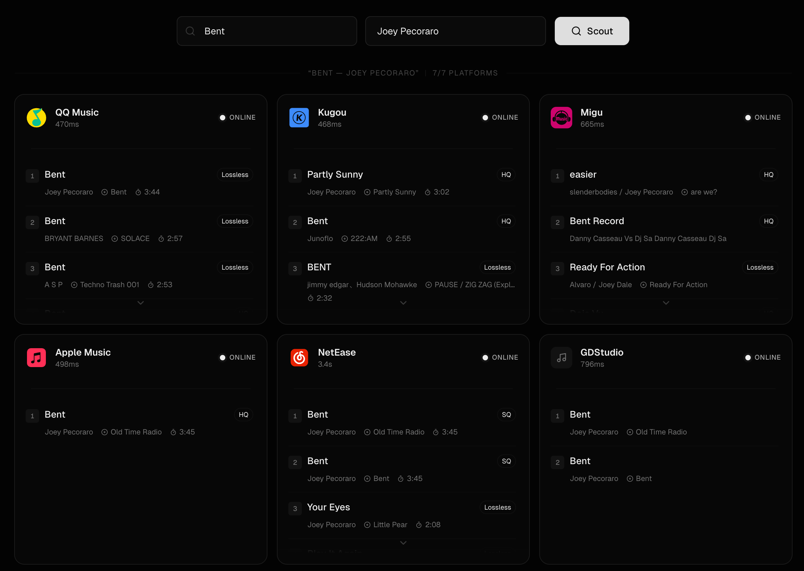

<div align="center">


# Mscout

**Cross-platform music availability checker.**

Search once, see results from 7 music platforms — instantly.

[](LICENSE)
[](https://www.typescriptlang.org/)
[](https://hono.dev/)
[](https://react.dev/)
[](https://turbo.build/repo)

</div>

---

## What is Mscout?

Mscout (Music Scout) searches multiple music platforms in parallel and shows you where a song is available, along with quality info, duration, album art, and more — all in one view.

<div align="center">
  
  <p><em>Homepage — Brand showcase with audio spectrum visualizer</em></p>
</div>

<div align="center">
  
  <p><em>Search Results — Cross-platform availability at a glance</em></p>
</div>

### Supported Platforms

| Platform | Region | Notes |
|----------|--------|-------|
| QQ Music | CN | Quality tiers (standard/HQ/lossless/Hi-Res) |
| NetEase Cloud Music | CN | Includes album art |
| Kugou Music | CN | Full quality info |
| Migu Music | CN | Hi-Res support |
| Apple Music / iTunes | Global | Preview URLs available |
| JOOX | SEA | Southeast Asia catalog |
| GDStudio | — | Community source |

## Quick Start

### Prerequisites

- [Node.js](https://nodejs.org/) >= 20
- [pnpm](https://pnpm.io/) >= 10

### Install & Run

```bash
# Clone
git clone https://github.com/index-null/mscout.git
cd mscout

# Install dependencies
pnpm install

# Start both frontend and backend in parallel
pnpm dev
```

Frontend runs at `http://localhost:5173`, backend API at `http://localhost:3000`.

## Architecture

```
mscout/
├── apps/
│   ├── web/            # React 19 + Vite 7 + Tailwind CSS 4
│   └── server/         # Hono 4 API (Node.js / Edge runtime)
├── packages/
│   └── shared/         # Shared TypeScript types
├── turbo.json          # Turborepo task orchestration
└── pnpm-workspace.yaml
```

### Tech Stack

| Layer | Technology |
|-------|-----------|
| **Frontend** | React 19, Vite 7, Tailwind CSS 4, shadcn/ui, Framer Motion |
| **Backend** | Hono 4, Zod validation, Adapter pattern |
| **Monorepo** | pnpm workspaces + Turborepo |
| **Type Safety** | Hono RPC (`hc<AppType>`) — end-to-end type inference |
| **Deployment** | Vercel (frontend) + Cloudflare Workers (backend) |

### End-to-End Type Safety

The backend exports `AppType` via Hono's chained route syntax. The frontend uses `hc<AppType>()` to get a fully typed API client — no manual type definitions, no code generation, no drift.

```typescript
// Backend: exports route types automatically
const app = new Hono()
  .post("/search", zValidator("json", searchSchema), async (c) => {
    return c.json(response);
  });
export type AppType = typeof app;

// Frontend: fully typed API calls
const client = hc<AppType>("/");
const res = await client.api.search.$post({ json: { song, artist } });
```

### Platform Adapter Pattern

Adding a new music platform is a single file:

```typescript
export class MyPlatformAdapter extends AbstractMusicPlatformAdapter {
  protected buildSearchRequest(query: SearchQuery): [string, RequestInit] {
    // Build the request
  }
  protected parseSearchResponse(data: unknown): SongInfo[] {
    // Parse the response
  }
}
```

Then register it in `registry.ts` — done.

## Scripts

| Command | Description |
|---------|-------------|
| `pnpm dev` | Start frontend + backend dev servers |
| `pnpm build` | Build all packages |
| `pnpm typecheck` | Type-check all packages |
| `pnpm lint` | Lint all packages |

### Package-scoped commands

```bash
# Run only the frontend
pnpm turbo run dev --filter=@mscout/web

# Build only the server
pnpm turbo run build --filter=@mscout/server
```

## Deployment

### Frontend → Vercel

1. Connect your GitHub repo to [Vercel](https://vercel.com)
2. Set **Root Directory** to `apps/web`
3. Vercel auto-detects Turborepo — zero config needed

### Backend → Cloudflare Workers

```bash
cd apps/server
pnpm deploy
```

> [!NOTE]
> The server entry supports dual-mode: `@hono/node-server` for local development, standard `export default app` for edge runtimes.

## Star History

[](https://www.star-history.com/#index-null/mscout&type=date)
