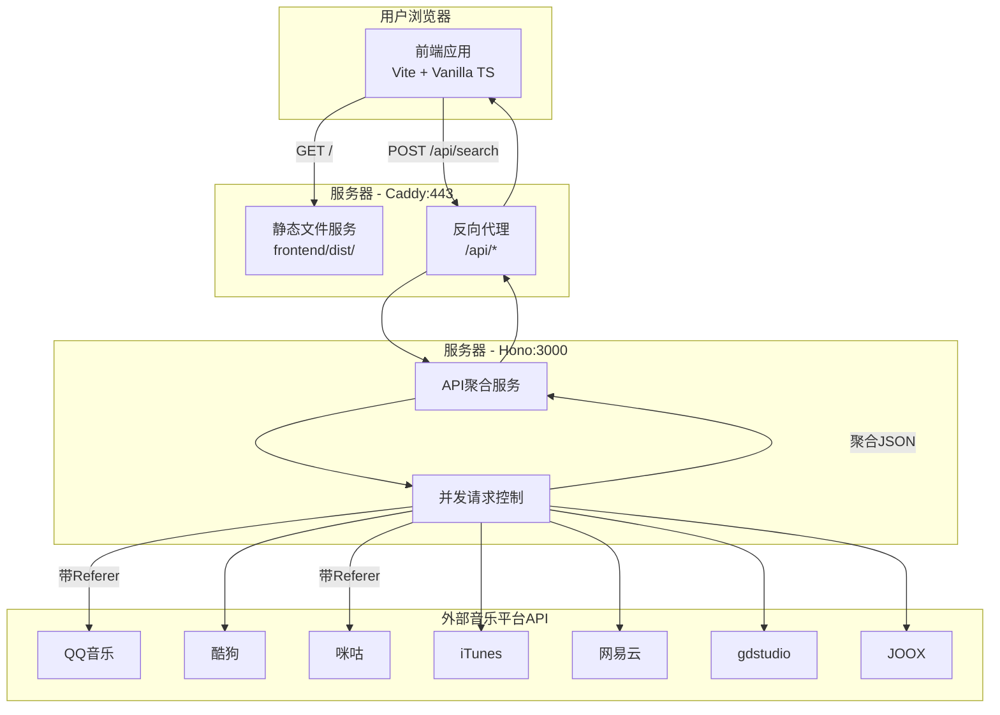

# 产品概述

一个音乐聚合查询门户,通过输入歌曲名和歌手,统一触发多平台查询并全部显示结果。项目采用轻量级技术栈,无重框架依赖,提供现代化用户体验。

## 核心功能

1. **多平台统一搜索**: 输入歌曲名+歌手后,同时查询 7 个音乐平台(QQ 音乐、酷狗、咪咕、Apple Music、网易云、gdstudio、JOOX)
2. **结果聚合展示**: 展示所有平台的搜索结果,包括歌曲名、专辑、时长、音质等信息
3. **平台状态标识**: 清晰显示每个平台的查询状态(成功/失败/超时)
4. **响应式布局**: 适配桌面端和移动端浏览器

# 技术栈选型

## 前端架构

- **构建工具**: Vite 6.0 + Rolldown (Rust 构建器,比 Rollup 快 50-70%)
- **语言**: TypeScript (vanilla,无框架)
- **样式**: 用户将单独指定(本次不涉及)
- **构建目标**: `esnext` (最小化产物体积)
- **预期产物**: < 50KB gzipped

## 后端代理

- **框架**: Hono.js (核心 14KB,TypeScript 原生支持)
- **运行时**: Node.js 20+
- **功能**: CORS 代理、API 聚合、并发请求处理
- **代码量**: 约 150 行搞定全部代理逻辑

## 部署方案

- **Web 服务器**: Caddy 2 (自动 HTTPS、极简配置)
- **进程管理**: PM2 (cluster 模式)
- **部署方式**: 前端静态文件 + 后端 Node 服务
- **HTTPS**: Let's Encrypt 自动证书(Caddy 内置)

---

# 实现方案

## 1. 技术架构

### 系统架构



### API 设计

**端点**: `POST /api/search`

**请求体**:

```
{
  "song": "晴天",
  "artist": "周杰伦"
}
```

**响应体**:

```
{
  "query": { "song": "晴天", "artist": "周杰伦" },
  "timestamp": 1709280000000,
  "results": {
    "qq": {
      "status": "success",
      "duration": 523,
      "data": {
        "songid": 97773,
        "songname": "晴天",
        "singer": "周杰伦",
        "album": "叶惠美",
        "interval": 269
      }
    },
    "kugou": {
      "status": "error",
      "duration": 2000,
      "error": "超时"
    }
  }
}
```

---

## 2. 实现细节

### 前端实现要点

1. **模块化组织**

- `main.ts`: 应用入口,初始化事件监听
- `api.ts`: 封装 fetch 请求,统一错误处理
- `types.ts`: 定义所有 TypeScript 接口
- `components/`: UI 渲染逻辑(纯函数)
- `utils/`: 工具函数(时间格式化、音质显示等)

2. **状态管理**

- 使用原生 TypeScript 变量管理状态
- 事件驱动的 UI 更新机制
- 无需引入状态管理库

3. **性能优化**

- 前端渐进式渲染(先显示快速响应的平台)
- 实现请求取消机制(AbortController)
- 避免不必要的 DOM 操作

### 后端实现要点

1. **Hono 服务架构**

```typescript
// 目录结构
server/src/
├── index.ts              // 入口:启动服务、注册中间件
├── routes/
│   └── search.ts         // 搜索路由:并发调用7个平台
└── platforms/            // 平台适配器
    ├── types.ts          // 统一接口定义
    ├── qq.ts             // QQ音乐(带Referer)
    ├── kugou.ts          // 酷狗
    ├── migu.ts           // 咪咕(带Referer)
    ├── itunes.ts         // Apple Music
    ├── netease.ts        // 网易云
    ├── gdstudio.ts       // gdstudio
    └── joox.ts           // JOOX
```

2. **关键实现模式**

- **统一平台接口**: 每个平台适配器实现相同的`search(song, artist)`接口
- **并发控制**: 使用`Promise.allSettled`同时请求 7 个平台,避免单点故障
- **超时控制**: 每个请求设置 2 秒超时,防止慢平台阻塞
- **错误隔离**: 单个平台失败不影响其他平台结果返回

3. **CORS 配置**

```typescript
import { cors } from "hono/cors";

app.use(
  "/api/*",
  cors({
    origin: ["https://music.yourdomain.com"], // 生产域名
    allowMethods: ["POST", "OPTIONS"],
    allowHeaders: ["Content-Type"],
  })
);
```

4. **性能优化**

- 使用 AbortSignal.timeout 实现超时控制
- 合理设置 HTTP 连接复用
- 结构化日志记录,便于性能分析

### Vite 配置优化

```typescript
// vite.config.ts
export default defineConfig({
  build: {
    target: "esnext", // 现代浏览器目标
    minify: "esbuild", // 使用esbuild压缩
    sourcemap: false, // 生产环境关闭sourcemap
    rollupOptions: {
      output: {
        manualChunks: {
          // 如果引入第三方库,分离vendor chunk
        },
      },
    },
    chunkSizeWarningLimit: 500,
  },
  server: {
    port: 5173,
    proxy: {
      "/api": {
        target: "http://localhost:3000",
        changeOrigin: true,
      },
    },
  },
});
```

---

## 3. 部署配置

### Caddyfile 配置

```
music.yourdomain.com {
    # API反向代理到Hono服务
    handle /api/* {
        reverse_proxy localhost:3000
    }

    # 静态文件服务
    handle {
        root * /var/www/music-portal/frontend/dist
        file_server
        try_files {path} /index.html
    }

    # 启用gzip压缩
    encode gzip

    # 安全头
    header {
        X-Content-Type-Options "nosniff"
        X-Frame-Options "DENY"
        Referrer-Policy "strict-origin-when-cross-origin"
    }
}
```

### PM2 配置

```javascript
// ecosystem.config.js
module.exports = {
  apps: [
    {
      name: "music-api-proxy",
      script: "./dist/index.js",
      cwd: "/var/www/music-portal/server",
      instances: 2,
      exec_mode: "cluster",
      env_production: {
        NODE_ENV: "production",
        PORT: 3000,
      },
      error_file: "./logs/err.log",
      out_file: "./logs/out.log",
      log_date_format: "YYYY-MM-DD HH:mm:ss Z",
    },
  ],
};
```

---

## 4. 性能与可靠性

### 性能指标

| 指标       | 目标值      | 实现方式                          |
| ---------- | ----------- | --------------------------------- |
| 前端包体积 | < 50KB gzip | Vite tree shaking + esnext target |
| 首屏加载   | < 1s        | 静态资源优化 + 预加载关键资源     |
| API 响应   | < 2s        | 并发请求 + 超时控制               |
| 后端内存   | < 100MB     | 无状态设计 + 轻量框架             |

### 可靠性保障

1. **错误处理**

- 前端: 全局错误捕获 + 友好提示
- 后端: 统一错误中间件 + 结构化日志

2. **超时控制**

- 单个平台请求超时: 2 秒
- 整体 API 响应超时: 5 秒
- 前端请求超时: 10 秒

3. **降级策略**

- 单个平台失败不影响整体结果
- 返回部分成功的结果
- 前端渐进式渲染

4. **日志记录**

- 后端请求日志: 包含平台、耗时、状态
- 错误日志: 包含堆栈、上下文
- 使用 Hono 的 logger 中间件

---

## 5. 目录结构

```
music-online-status-check/
├── frontend/                           # Vite前端项目
│   ├── src/
│   │   ├── main.ts                    # [NEW] 应用入口,事件绑定
│   │   ├── api.ts                     # [NEW] API客户端封装
│   │   ├── types.ts                   # [NEW] TypeScript类型定义
│   │   ├── components/                # [NEW] UI组件目录
│   │   │   ├── SearchForm.ts         # [NEW] 搜索表单组件
│   │   │   ├── ResultList.ts         # [NEW] 结果列表组件
│   │   │   └── PlatformCard.ts       # [NEW] 单个平台卡片组件
│   │   └── utils/                     # [NEW] 工具函数
│   │       ├── format.ts              # [NEW] 格式化工具(时间、音质等)
│   │       └── request.ts             # [NEW] 请求封装(超时、取消等)
│   ├── public/                        # [NEW] 静态资源目录
│   │   └── logo/                      # [MOVE] 从根目录移动平台图标到此
│   ├── index.html                     # [NEW] HTML入口
│   ├── vite.config.ts                 # [NEW] Vite配置(优化构建)
│   ├── tsconfig.json                  # [NEW] TypeScript配置
│   └── package.json                   # [NEW] 前端依赖管理
│
├── server/                             # Hono后端项目
│   ├── src/
│   │   ├── index.ts                   # [NEW] 服务入口,注册路由和中间件
│   │   ├── routes/
│   │   │   └── search.ts              # [NEW] 搜索路由,协调7个平台查询
│   │   └── platforms/                 # [NEW] 平台适配器目录
│   │       ├── types.ts               # [NEW] 平台接口统一定义
│   │       ├── qq.ts                  # [NEW] QQ音乐适配器(需Referer)
│   │       ├── kugou.ts               # [NEW] 酷狗适配器
│   │       ├── migu.ts                # [NEW] 咪咕适配器(需Referer)
│   │       ├── itunes.ts              # [NEW] Apple Music适配器
│   │       ├── netease.ts             # [NEW] 网易云适配器
│   │       ├── gdstudio.ts            # [NEW] gdstudio适配器
│   │       └── joox.ts                # [NEW] JOOX适配器
│   ├── tsconfig.json                  # [NEW] TypeScript配置
│   └── package.json                   # [NEW] 后端依赖管理
│
├── deployment/                         # [NEW] 部署配置目录
│   ├── Caddyfile                      # [NEW] Caddy配置(反向代理+静态服务)
│   └── ecosystem.config.js            # [NEW] PM2配置(进程管理)
│
├── logo/                               # [EXISTING] 保留原位置作为文档参考
├── music-api-reference.md              # [EXISTING] API文档
└── README.md                           # [NEW] 项目说明文档
```

**说明**:

- `[NEW]`: 新建文件
- `[EXISTING]`: 已存在文件
- `[MOVE]`: 移动文件
- 所有 TypeScript 文件均包含完整类型定义
- 前后端分离,独立的 package.json 和 tsconfig.json

## MCP 工具

### exa - web_search_exa

- **用途**: 在实现过程中如需查询 2026 年最新的 Hono.js、Vite 6.0、Caddy 最佳实践和配置示例
- **预期结果**: 获取最新的技术文档、代码示例和性能优化方案,确保实现方案采用当前最佳实践

### exa - get_code_context_exa

- **用途**: 查找 Hono.js CORS 代理、Vite vanilla TypeScript 生产构建的经验证代码示例
- **预期结果**: 获取可靠的代码模式和配置,减少试错成本
